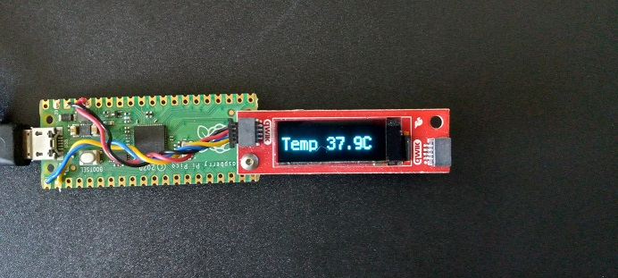

# Thermometer simulator
Simple digital thermometer simulator based on Raspberry Pi Pico and
an OLED. Of course, it's in Python ;-)

~~~
# Code designed for Raspberry Pi Pico running CircuitPython 8.2
# Simulates a digital thermometer using an OLED for display

# Imports
import time 
import random
import board
import busio
import digitalio
import displayio
import terminalio
import adafruit_displayio_ssd1306 as ssd1306
from adafruit_display_text import label

# Compatibility with both CircuitPython 8.x.x and 9.x.x.
# Remove after 8.x.x is no longer a supported release.
try:
    from i2cdisplaybus import I2CDisplayBus
    print ("Imported from i2cdisplaybus")
except ImportError:
    from displayio import I2CDisplay as I2CDisplayBus
    print ("Imported from displayio")
    
# Reinitalizes display upon any soft reboot or hard reset
displayio.release_displays()

# Set up I2C and the pins we're using for it
i2c0 = busio.I2C(scl=board.GP1, sda=board.GP0)

# Short delay to stop I2C falling over
time.sleep(1) 

# Configure display size
ssd_width = 128
ssd_height = 32

# Ensure the physical address of your SSD1306 is set here:
ssd_bus = I2CDisplayBus(i2c0, device_address=0x3C)
display = ssd1306.SSD1306(ssd_bus, width=ssd_width, height=ssd_height)

# Text labels for display
temp_label = label.Label(terminalio.FONT)
temp_label.anchor_point = (0.0, 0.0)
temp_label.anchored_position = (0, 10)
temp_label.scale = 2

# Create DisplayIO Group Layer
layer1 = displayio.Group()
layer1.append(temp_label)
display.root_group = layer1

temp = 37.0
while True:
    temp_label.text = f"Temp {temp:.1f}C"
    time.sleep(2)
    temp += 0.1
~~~

---

# theselittlemachines
(home is BallSpeed project)
This project measures the speed of a ball and takes actions depending on how fast it's going.

---
