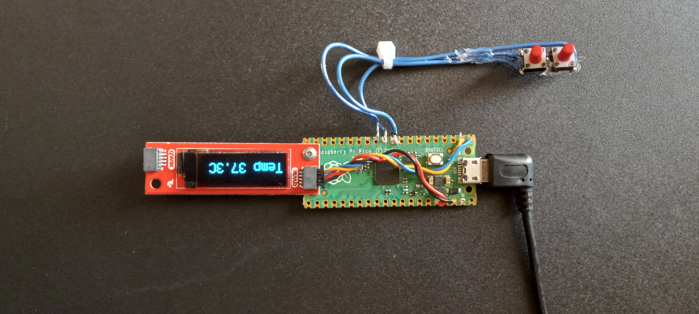

## [Thermometer simulator ](https://github.com/cedarlakeinstruments/theselittlemachines/edit/main/README.md#thermometer-simulator)

Simple digital thermometer simulator based on Raspberry Pi Pico and
a Sparkfun SSD1306-type OLED connected via I2C. Of course, the code's written in Python ;-)

You can download it [here](code/code.py)

The desire is to display a temperature that is adjustable in 0.1 degree increments by pushbuttons. The pushbuttons are connected between Ground and GP7 & GP8.
At least, that was the intent. However, my ham-fisted soldering connected the common to GP9 instead of GND.

No problem, though. We'll just turn GP9 into an output and pull it to GND. Accomplishes the same thing and I don't have to fix my wiring :-)

~~~
# Code designed for Raspberry Pi Pico running CircuitPython 9.2
# Simulates a digital thermometer using an OLED for display

# Imports
import time 
import random
import board
import busio
import digitalio
from adafruit_debouncer import Debouncer
import displayio
import terminalio
import adafruit_displayio_ssd1306 as ssd1306
from adafruit_display_text import label

# Compatibility with both CircuitPython 8.x.x and 9.x.x.
# Remove after 8.x.x is no longer a supported release.
try:
    from i2cdisplaybus import I2CDisplayBus
    print ("Imported from i2cdisplaybus")
except ImportError:
    from displayio import I2CDisplay as I2CDisplayBus
    print ("Imported from displayio")
    
# Reinitalizes display upon any soft reboot or hard reset
displayio.release_displays()

# Set up I2C and the pins we're using for it
i2c0 = busio.I2C(scl=board.GP1, sda=board.GP0)

# Short delay to stop I2C falling over
time.sleep(1) 

# Configure display size
ssd_width = 128
ssd_height = 32

# Ensure the physical address of your SSD1306 is set here:
ssd_bus = I2CDisplayBus(i2c0, device_address=0x3C)
display = ssd1306.SSD1306(ssd_bus, width=ssd_width, height=ssd_height)

# Text labels for display
temp_label = label.Label(terminalio.FONT)
temp_label.anchor_point = (0.0, 0.0)
temp_label.anchored_position = (0, 10)
temp_label.scale = 2

# Create DisplayIO Group Layer
layer1 = displayio.Group()
layer1.append(temp_label)
display.root_group = layer1

# Pushbuttons on pins 7 & 8
up_pin = digitalio.DigitalInOut(board.GP8)
up_pin.direction = digitalio.Direction.INPUT
up_pin.pull = digitalio.Pull.UP
buttonUp = Debouncer(up_pin)

down_pin = digitalio.DigitalInOut(board.GP7)
down_pin.direction = digitalio.Direction.INPUT
down_pin.pull = digitalio.Pull.UP
buttonDown = Debouncer(down_pin)

# debug due to my wiring screwup
gnd = digitalio.DigitalInOut(board.GP9)
gnd.direction = digitalio.Direction.OUTPUT
gnd.value = False

temp = 37.0
last_temp = 0.0
# Constants
TEMP_INCREMENT = 0.1
TEMP_MIN = 30
TEMP_MAX = 40

while True:
    buttonUp.update()
    buttonDown.update()
    # Check button change state
    if buttonDown.fell:
        temp -= TEMP_INCREMENT
        print(temp)
    elif buttonUp.fell:
        temp += TEMP_INCREMENT
        print(temp)
        
    if temp < TEMP_MIN:
        temp = TEMP_MIN
    elif temp > TEMP_MAX:
        temp = TEMP_MAX
    
    # Only update on a change
    if last_temp != temp:
        # Format for display   
        temp_label.text = f"Temp {temp:.1f}C"
        last_temp = temp
~~~

---

# [ballSpeed](https://github.com/cedarlakeinstruments/theselittlemachines/edit/main/README.md#ball-speed)
This project measures the speed of a ball and takes actions depending on how fast it's going. It plays audio feedback depending on the speed of the ball.

---
